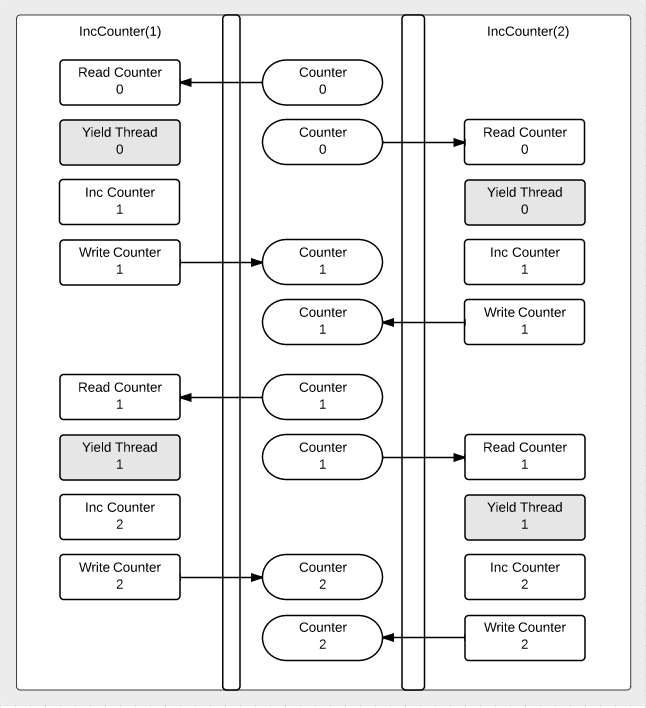

# 동시성과 병렬성 

Go 언어로 작성된 프로그램을 오직 1개의 CPU를 가진 머신에서 실행할 경우,  
그 프로그램은 병렬로 실행되지 않을 것이다.  

동시에 실행되지 않기 때문에, 동시에 실행되는 코드의 다중 스레드가 병렬로 주어지지 않을 것이다.  
대신 순차적으로 실행된다.  

CPU가 하나이기 때문에 명령어가 하나씩 차례로 이어질 것이다.
하지만 2개 이상의 CPU를 가지고 있을 경우, 코드를 병렬로 실행할 수 있는 기회가 주어진다.  

동시성이란 무엇일까?  
동시성은 디자인 패턴이다. 코드를 작성하는 방식이다.  
싱글 코어 CPU에서 하나의 프로세스가 멀티 스레드 코드를 갖고 번갈아 가며 실행되도록 한다.  

여기까지 정리하자면, 병렬성은 물리적인 개념이고, 동시성은 논리적인 개념이다.  

> 동시성은 CPU Core가 1개일 때, 여러 프로세스를 짧은 시간동안 번갈아 가면서  
> 연산을 하게 되는 시분할 시스템으로 실행된다.  
> 병렬성은 CPU Core가 여러개일 때,  각각의 Core가 각각의 프로세스를 연산함으로써   
> 프로세스가 동시에 실행되는 것이다.  
> 출처: 인프런 개발남노씨, 기출로 대비하는 개발자 전공면접 [CS 완전정복] 

# Go routines

고루틴은 단순한 함수 모델을 갖는다.  
고루틴은 같은 주소 공간에서 다른 고루틴과 동시에 실행되는 함수이다.

고루틴은 OS의 멀티 스레드에 멀티플렉싱 된다.  
입력 및 출력 작업을 위해 대기 중일 때와 같이 하나의 고루틴이 블락되면 다른 고루틴이 계속 실행된다.  
이런 설계로 인해 여러 복잡한 생성과 관리가 드러나지 않는다.

> 멀티플렉서 (또는 MUX) 는 여러 아날로그 또는 디지털 입력 신호 중 하나를 선택하여  
> 선택된 입력을 단일 라인에 전달하는 장치이다.   
> ~ 위키백과 ~

Go 에서 고루틴을 사용하기 위해서는 `go` 키워드를 함수나 메소드 앞에 붙인다.
하나의 고루틴에서 새 고루틴을 호출하여 실행했을 때, 하나의 고루틴 호출이 완료되면 새 고루틴은 자동으로 종료된다.  
(새 고루틴이 어떤 작업을 하고, 작업을 완료시키는 것을 기다려주지 않기 때문,  
공식 설명에서는 백그라운드에서 명령을 수행하는 유닉스 쉘 및 표기법과 유사하다고 한다. )

또한 고루틴에 사용된 함수가 반환값을 갖는 경우, 함수가 완료될 때 삭제된다.  
(반환값을 갖는 함수를 고루틴에 사용할 때, 함수 리터럴이나 또 다른 함수로 래핑해 사용하기를 권장한다. )

`go list.Sort()`

함수 리터럴은 고루틴 호출에 유용하다.     
(익명함수를 뜻하는 것 같다. )

```go
func Announce(message string, delay time.Duration) {
	go func() {
		time.Sleep(delay)
		fmt.Println(message)   
    } ()
}
```

함수 리터럴은 클로저이다.  
함수가 참조하는 변수를 사용하는 동안에는 그 생존을 보장하는 방식으로 구현되어 있다.  
다만, 위 샘플은 권장하지 않는 방식이다. 함수가 종료를 알릴 방법이 없기 때문이다.

이를 위해서는 `채널` 이 필요하다.

# 동시성 코드  

Go 언어에서 동시성 코드를 작성하는 방법은 간단하다.  
`go` 키워드를 이용하면 된다.  

```go
package main 

import (
	"fmt"
	"runtime" 
)

func main() {
	fmt.Println("OS\t\t", runtime.GOOS)
	fmt.Println("ARCH\t\t", runtime.GOARCH)
	fmt.Println("CPUs\t\t", runtime.NumCPU())
	fmt.Println("Goroutines\t\t", runtime.NumGoroutine()) // 1
	
	go foo() 
	bar()
	
	fmt.Println("CPUs\t\t", runtime.NumCPU())
	fmt.Println("Goroutines\t\t", runtime.NumGoroutine()) // 2
}

func foo() {
	for i:=0; i<10; i++ {
		fmt.Println("foo ", i) 
    }
}

func bar() {
	for i:=0; i<10; i++ {
		fmt.Println("bar", i)
    }
}
```

위 샘플을 실행해 보면, 처음에는 고루틴이 1개 였지만  
`go` 키워드가 사용된 `foo()` 를 만나면서 고루틴이 2개가 되는걸 확인할 수 있을 것이다.  
그런데 bar()의 내용이 출력되지만, foo()의 내용은 출력되지 않는 것도 확인될 것이다.  

처음에 고루틴이 1개 였던 이유는 main()이 이미 1개의 고루틴으로 실행되기 때문이고,  
또 다른 고루틴인 foo()를 만나면서, 이 foo()가 다른 루틴으로 처리되기 때문이다.

이때, 흐름제어는 foo()의 처리를 전혀 기다려주지 않으면서 main() 안에 명령문 처리를 계속 진행하게 된다.  
그러면 foo()의 처리가 끝나기도 전에 main()이 먼저 종료될 것이고, foo()도 같이 종료되버릴 것이다.  

따라서 일종의 동기화 작업이 필요한 상황이다.  
작성한 코드에게 기다리라는 작업을 해줄 필요가 있는 것이다.  

이 작업에는 `Mutex(상호배제 잠금)`, `WaitGroup` 등이 필요하다.  
이들은 코드가 실행을 마칠 때까지 기다려달라는 기능을 수행할 수 있다.  
여기서는 `WaitGroup` 을 이용한다.

```go
package main

import (
	"fmt"
	"runtime"
	"sync"
)

// Added, Here! 
var wg sync.WaitGroup

func main() {
	fmt.Println("OS\t\t", runtime.GOOS)
	fmt.Println("ARCH\t\t", runtime.GOARCH)
	fmt.Println("CPUs\t\t", runtime.NumCPU())
	fmt.Println("Goroutines\t\t", runtime.NumGoroutine()) // 1

	wg.Add(1) // 기다려야 할 작업(고루틴) 1개 추가 
	go foo()
	bar()

	fmt.Println("CPUs\t\t", runtime.NumCPU())
	fmt.Println("Goroutines\t\t", runtime.NumGoroutine()) // 2
	wg.Wait() // 작업이 끝날 때까지 기다려!
}

func foo() {
	for i := 0; i < 10; i++ {
		fmt.Println("foo ", i)
	}
	wg.Done() // WaitGroup 에 등록된 작업 끝났어!  
}

func bar() {
	for i := 0; i < 10; i++ {
		fmt.Println("bar", i)
	}
}
```

위 샘플을 실행하면 main() 은 종료되기 직전에 WaitGroup에 등록된 작업들이 끝날때 까지 기다려 줄 것이다.  
bar()와 고루틴의 개수가 출력되고 나서 foo()에 대한 작업 내용을 확인할 수 있을 것이다.  

# Share by communicating 

동시성 프로그래밍은 광범위한 주제이기 때문에 여기에서는 Go에 한정된 중요한 내용에 대해서만 언급한다.  

__`공유변수` 에 대한 정확한 액세스를 구현하는 데 요구되는 세부 사항들로 다양한 환경에서의 동시성 프로그래밍이  
어려워졌다.__  
> "많은 환경에서 다수의 고루틴이 작동하고 있고, 그것들이 변수에 대한 액세스를 공유하는 경우에 동시성이 어렵다. "  
> ~ Todd ~ 

  

위 그림에서, IncCounter() 라고 하는 고루틴이 두 개 존재하고, Counter 라는 공유 변수가 주어졌다.  
고루틴은 Counter 를 읽을 수 있고, 다른 고루틴도 마찬가지다.  

`스레드 양보(Yield Thread)` 라는 것은 실행 흐름을 다른 스레드에게 넘긴 다는 것으로 병렬로 작성할 수도 있다.  
고루틴들은 Counter 변수를 0부터 읽는다. 그 다음 1씩 증가 시킨다.  
각각의 고루틴이 0에서 1로 증가시킨 다음에 공유 변수에 Counter 를 다시 기록하고 있다.  

둘이서 공유 변수를 1씩 증겨 시켰다면 Counter 가 2가 되는 것이 정상적인 상황이지만, 그러지 못하고 있다.  
프로세스가 중첩하는 방식 때문에 이들이 공유 변수를 읽고 둘 다 증가시킨 다음, 둘 모두 변수를 다시 작성하고 있다.  
이는 공유 변수에 대한 읽기 및 쓰기가 잘못된 경우이다.  

이것을 `경쟁 상태(Data race)` 라고 한다.  

> Do not communicate by sharing memory. instead, share memory by communicating.  
> ~ Effective Go ~
 
경쟁상태를 해결하는 방법으로는 ___뮤텍스, 아토믹, 채널___ 이 있다.

```go
package main

import (
	"fmt"
	"runtime"
	"sync"
	"time"
)

func main() {
	fmt.Println(runtime.NumCPU())
	fmt.Println(runtime.NumGoroutine())

	counter := 0
	const gs = 100

	var wg sync.WaitGroup
	wg.Add(gs)

	for i := 0; i < gs; i++ {
		go func() {
			v := counter
			// time.Sleep(time.Second) // Sleep은 고루틴을 대기상태로 만든다. 
			runtime.Gosched() // 다른 고루틴이 실행되면서 그 프로세서를 양보한다. 
			v++
			counter = v
			wg.Done()
		}()
	}
	wg.Wait()
	fmt.Println(runtime.NumGoroutine())
	fmt.Println("Counter: ", counter)
}
```

이 샘플은 위 그림을 코드로 표현한 것이다.  
코드를 통해 어떻게 경쟁 상태를 해결해 나가는지 알아보자.  

위 샘플을 실행하면 결과는 아래와 같다.  

```text
CPUs: 1
Goroutines: 1
Goroutines: 1
Counter: 2 
```

결과는 현재 실행환경의 코어가 몇 개 있는가에 따라서 달라진다.  
CPUs 가 8인 환경이라면 Counter 에 대한 결과가 70, 81, 75, 93 등등  
실행할 때 마다 달라질 것이다.  

고 커맨드에서 고 프로그램의 이런 경쟁 상태에 대해서 체크할 수 있는데,  
`go run -race main.go` 와 같이 고 프로그램을 실행시키면 된다.  

그러면 몇 개의 경쟁 상태가 있는지 알려줄 것이다.  
앞서 말한대로, 고루틴의 경쟁 상태는 아토믹, 뮤텍스, 채널 등으로 해결할 수 있다.  

경쟁 상태가 발생하는 이유는 다수의 고루틴이 존재하기 때문이다.  
여러 고루틴이 공유 변수에 액세스 하고 있다면, 다른 고루틴이 액세스에 대해 체크할 수 있어야 한다.  
도서관의 대출 시스템과 비슷하다고 보면 된다.  

아무도 어떤 작업이 완료될 때까지 사용할 수 없어야 한다.   
작업이 끝났음을 알려준다면 다음 차례가 그것의 잠금을 해제할 수 있어야 한다.  
그럼 다음 고루틴이 공유 변수를 사용할 수 있다.  

```go
package main

import (
	"fmt"
	"runtime"
	"sync"
	"time"
)

func main() {
	fmt.Println(runtime.NumCPU())
	fmt.Println(runtime.NumGoroutine())

	counter := 0
	const gs = 100

	var wg sync.WaitGroup
	var mux sync.Mutex
	wg.Add(gs)

	for i := 0; i < gs; i++ {
		go func() {
			mux.Lock() // 뮤텍스가 이 코드 덩어리를 잠근다. 
			v := counter
			// time.Sleep(time.Second) // Sleep은 고루틴을 대기상태로 만든다. 
			runtime.Gosched() // 다른 고루틴이 실행되면서 그 프로세서를 양보한다. 
			v++
			counter = v
			mux.Unlock() // 잠금이 풀린다. 
			wg.Done()
		}()
		fmt.Println("Go routines: ", runtime.NumGoroutine())
	}
	wg.Wait()
	fmt.Println(runtime.NumGoroutine())
	fmt.Println("Counter: ", counter)
}
```

뮤텍스를 적용한 코드이다. 뮤텍스로 Lock() 한 시점에서 다른 고루틴은 counter 에 액세스할 수 없다.  
그리고 Unlock() 이 되면 다른 고루틴이 counter 에 액세스할 수 있다.  

실행되는 고루틴 개수가 일정할 것이고, Counter 도 원했던 100 이라는 결과를 출력한다.  

다음 문서를 꼭 읽어보길 바란다. 
* https://godoc.org/sync#Mutex.Lock

# Atomic 

아토믹(Atomic) 은 동기화 알고리즘을 구현하는 데 유용한 저수준의 아토믹 메모리 원시 자료형을 제공한다.  
아토믹 역시 경쟁 상태를 피하는 역할을 하는데 사용한다.  

https://godoc.org/sync/atomic 에서 자세히 학습할 수 있다.  
아토믹은 동기화에 대한 깊은 이해가 필요하기 때문에 공부를 많이해야 한다.  
(공부 싫어)

```go
package main

import (
	"fmt"
	"runtime"
	"sync"
	"sync/atomic"
)

func main() {
	fmt.Println(runtime.NumCPU())
	fmt.Println(runtime.NumGoroutine())

	var counter int64
	const gs = 100

	var wg sync.WaitGroup
	wg.Add(gs)

	for i := 0; i < gs; i++ {
		go func() {
			atomic.AddInt64(&counter, 1) // 아토믹은 int64 포인터를 요구한다.
			runtime.Gosched() // 다른 고루틴이 실행되면서 그 프로세서를 양보한다.
			fmt.Println("Counter: ", atomic.LoadInt64(&counter))
			wg.Done()
		}()
	}
	wg.Wait()
	fmt.Println(runtime.NumGoroutine())
	fmt.Println("Counter: ", counter)
}
```

# Channel

Go 에서 동시성 코드를 작성하는 보다 나은 고급 방법이다.

```go
package main 

import (
	"fmt"
)

func main() {
	c := make(chan int) // 정수를 넣는 채널  
	
	c <- 42 
	
	fmt.Println(<-c) 
}
```

채널은 데이터를 보낼 수 있는 공간이다.  
위 코드를 실행하면 모든 고루틴이 슬립 상채라 교착 상태에 빠졌다고 할 것이다.  
이유는 채널이 막혀있기 때문이다.  

채널로 데이터를 송수힌 하는 것은 계주와도 같다.  
지금은 바통을 들고 뛰다가 손에서 손으로 건네 줘야 하는 상황 같아서 트랜잭션이 발생할 수 없다.  
트랜잭션이 발생하려면 송수신이 동시에 실행될 수 있어야 한다.  
동시에 실행될 수 없다면 받는 대상이 데이터를 빼낼 수 있을 때까진 송수신은 차단된다.  

```go
package main 

import "fmt" 

func main() {
	
	c := make(chan int) 
	
	go func() {
		c <- 42
    }()
	
	fmt.Println(<-c)
}
```

트랜잭션을 발생시키기 위해 고루틴과 채널을 이용한 동시성 코드를 작성했다.  
위 샘플에서는 main() 에서 발생한 다른 고루틴에서 채널에 값을 보내고,  
main() 고루틴에서 채널의 값을 받음으로 하나의 트랜잭션이 완성됐다.  

# Buffer Channel 

버퍼 채널은 채널 안에 값이 머물 수 있게 한다.  
(값을 수신할 주체가 없더라도)  

```go
package main 

import "fmt" 

func main() {
	
	c := make(chan int, 1) 
	
    c <- 42
	c <- 43 
	
	fmt.Println(<-c)
}
```

위 샘플에서 c 를 버퍼 채널로 만들었고, 채널 안에는 값이 하나 머물고 있게 된다.  
채널 안에 값이 하나만 대기하고 있는 것이다.  

이렇게 하면 수신 주체가 없더라도 채널 c 는 42라는 값을 갖을 수 있다.  
하지만 채널이 43이라는 값을 가지려 할 때는 차단된다.  
왜냐하면 버퍼 채널이 이미 값을 가지고 있고 그 값을 빼내기 전까진 값을 가질 수 없도록 설계되어 있기 때문이다.  
(fatal error: all goroutines are sleep - deadlock!)  

```go
package main 

import "fmt" 

func main() {
	
	c := make(chan int, 2) 
	
    c <- 42
    c <- 43 
	
	fmt.Println(<-c)
	fmt.Println(<-c)
}
```

문제를 해결하려면 버퍼 공간을 키워주면 된다.  
크기를 1에서 2로 늘려주면 원하던 대로 값을 두 개 입력할 수 있고,  
`<-c` 를 두 번 호출하면서 값을 모두 뺄 수 있다.

> [ P O I N T ]  
> "Don't communicate by sharing memory, share memory by communicating"  
> 메모리 공유로 데이터를 전달하지 말고, 데이터를 전달함으로써 메모리를 공유해라.  


# 방향성이 있는 채널 (Directional Channel)   

위에서 다룬 채널들은 송수신 개념이 있는 양방향 채널인데,  
채널을 단방향으로 만들 수도 있다.  

## 송신 전용 채널  

```go
package main 

import "fmt" 

func main() {
	
	c := make(chan <- int, 2) // 송신 전용 채널  
	
    c <- 42
    c <- 43 
	
	fmt.Println(<-c) // 경고 
	fmt.Println(<-c) // 경고  
}
```

위 샘플은 버퍼 채널을 송신 전용 채널로 만든 것이다.  
그래서 값을 넣을 수는 있지만 뺄 수는 없는데, 빼려고 하면 값을 빼는 부분에서  
`Invalid operation: <-c (receive from send-only chan <- int)` 라는 경고문이 뜰 것이다.    

## 수신 전용 채널  

```go
ch := make(chan int) 
sender := make(chan <- int) // 송신 전용 채널
receiver := make(<- chan int) // 수신 전용 채널
```
송신 전용 채널 샘플에서 수신 전용 채널을 추가했다.  
송/수신 전용 채널을 어떻게 선언하는지 위 샘플을 통해 잘 봐둬야 한다.  

## 송/수신 채널의 이용 

다음으로 송신 전용 채널과 수신 전용 채널을 어떻게 사용하는지 샘플을 통해 알아보자.  

```go
package main 

import "fmt" 

// main
func main() {
	c := make(chan int) // 양방향 채널  
	
	// send 
	go sender(c)
	
	// receive
	receiver(c)
	
	fmt.Println("----exit----")
}

// send 
func sender(c chan<- int) { // 송신 전용 채널 
    c <- 42 	
}

// receive
func receiver(c <-chan int) { // 수신 전용 채널
	fmt.Println(<-c) 
}
``` 

위 샘플에서 왜 sender() 는 go 를 사용했고, receiver() 는 사용하지 않았을까?  
동시성 로직을 고려해서 작성된 코드이기 때문이다.  

main() 은 다른 고루틴의 작업이 끝날때 까지 기다려주지 않는다.  
따라서 receiver() 가 값을 수신할 수 있도록 고루틴으로 만들지 않고,  
값을 온전히 수신할 때 까지 sender() 의 작업이 끝나기를 기다린다.  

그러면 아래와 같은 출력 결과를 얻을 수 있다.  

```text
42
----exit----
```

## Range Pattern  

```go
package main 

import "fmt" 

// main
func main() {
	c := make(chan int) // 양방향 채널  
	
	// send 
	go sender(c)
	
	// receive
	receiver(c)
	
	fmt.Println("----exit----")
}

// send 
func sender(c chan<- int) { // 송신 전용 채널 
	for i:=1; i<100; i++ {
		c <- i
    }
	close(c) // 메인 채널을 닫는다. 채널은 새로운 메모리 공간에 생성되는데, 그걸 닫는다. 
}

// receive
func receiver(c <-chan int) { // 수신 전용 채널
	for v := range c {
		fmt.Println(v) 
    } 
}
``` 

close(c) 를 해서 메인 채널을 닫아주지 않으면 프로그램은 교착상태에 빠진다.  
receiver() 가 채널을 통해 계속해서 값을 받길 원하고 있기 때문이다.  
따라서 모든 값이 송신이 완료되면 꼭 close(c) 해준다.  

## Select Pattern   

```go
package main 

import (
	"fmt" 
)

func main() {
	eve := make(chan int) 
	odd := make(chan int) 
	quit := make(chan int) 
	
	// send
	go send(eve, odd, quit)  
	
	// recv
	recv(eve, odd, quit)
	
	fmt.Println("----exit----")
}

func recv(e, o, q <-chan int) {
	for {
		select {
                    case v := <-e :
                        fmt.Println("from the even channel: ", v)
                    case v := <-o :
                        fmt.Println("from the odd channel: ", v)
                    case v := <- q :
                        fmt.Println("from the quit chaanel: ", v)
                        return
		}
    }
}

func send(e, o, q chan<- int) {
	for i := 1; i<100; i++ {
		if i % 2 == 0 {
			e <- i
		} else {
			o <- i 
        }
    }
	close(q)
}
```

위 샘플은 여러 채널을 이용해서 짝수, 홀수, Quit 에 따른 송/수신을 알아보는 코드이다.   

## Comma Ok Pattern  

```go
package main

import (
	"fmt"
)

func main() {
	eve := make(chan int)
	odd := make(chan int)
	//quit := make(chan int)
	quit := make(chan bool) 
	
	// send
	go send(eve, odd, quit)

	// recv
	recv(eve, odd, quit)

	fmt.Println("----exit----")
}

func send(even, odd chan<- int, quit chan<- bool) {
	for i := 1; i<100; i++ {
		if i % 2 == 0 {
			even <- i
		} else {
			odd <- i
		}
	}
	close(quit)
}

func recv(even, odd <-chan int, quit <-chan bool) {
	for {
		select {
		    case v := <-even :
				fmt.Println("from the even channel: ", v)
            case v := <-odd : 
				fmt.Println("from  the oven channel: ", v) 
            case i, ok := <- quit : // quit 채널은 닫혔을 때 값을 전달한다.  
				if !ok {
					fmt.Println("not ok ", i, ok)
					return 
                } else {
					fmt.Println("ok", i)
                }
        }
    }
}
```
